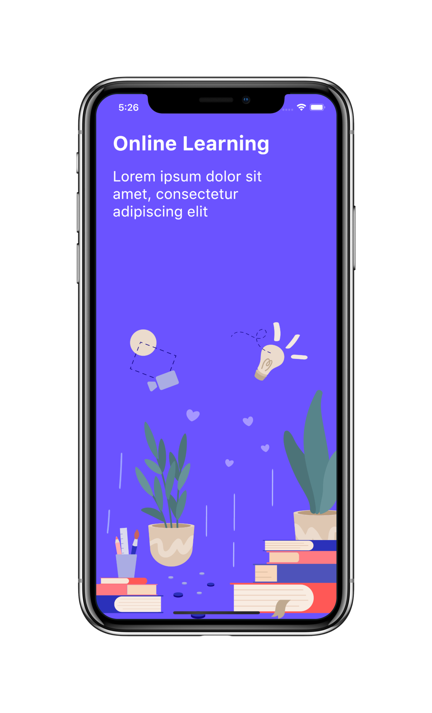
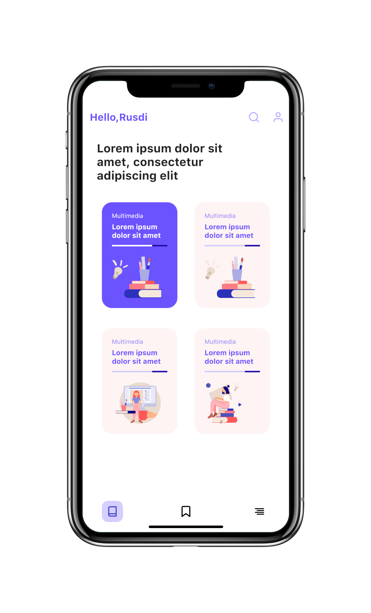

# Flutter UI - Online Learning

English------[中文](README_CN.md)

### Introduction

The online learning application is divided into three pages, namely the welcome introduction page, course display page and course catalog introduction page.

### Video

YouTube : [Watch it on YouTube]()

Bilibili : [Watch it on Bilibili]()

### UI 

 - Online Learning App Design by [Muhammad Rusdi](https://www.uplabs.com/muhrusdi)

### Online Learning Design UI

### Online Learning Final UI

     

