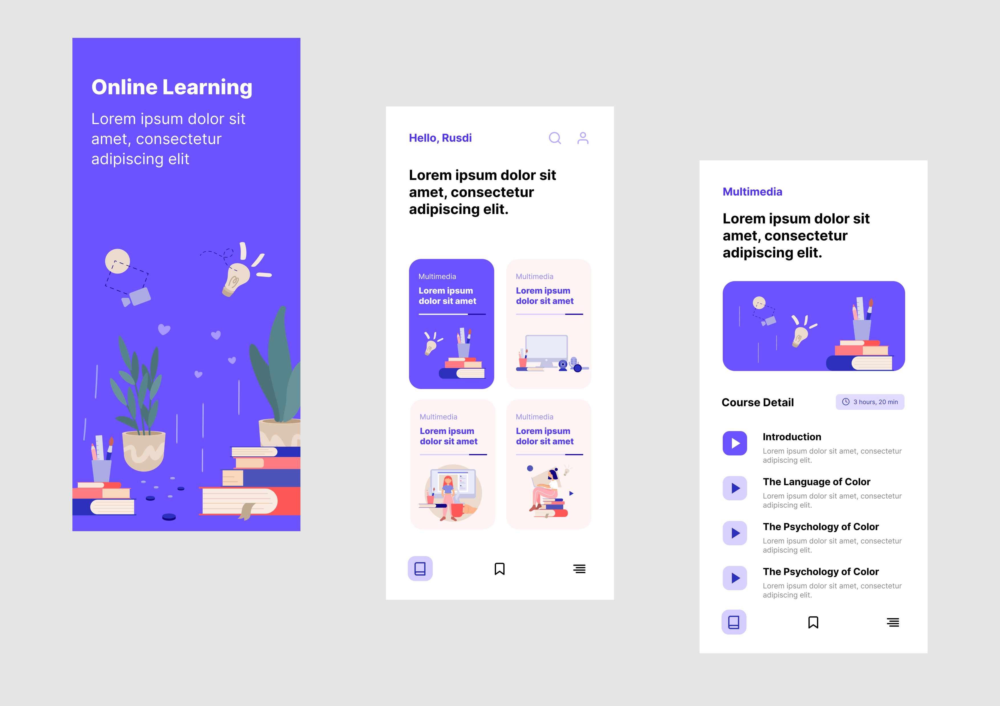
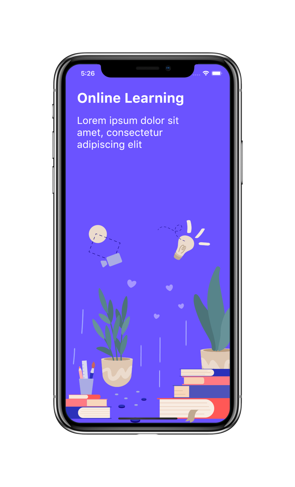
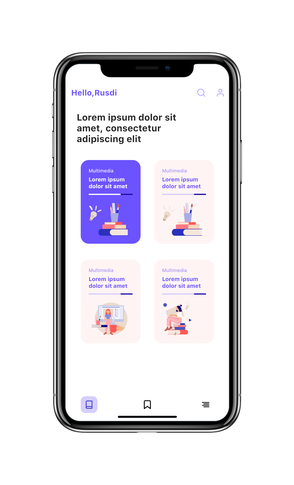
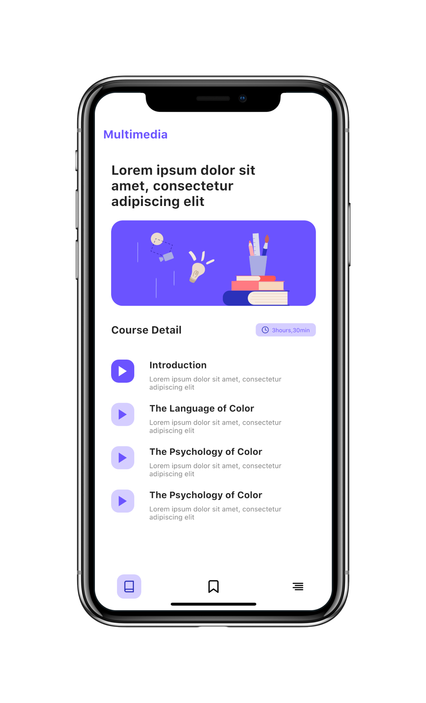

# Flutter UI - Natur Furniture

[English](README.md)------中文

### 介绍

在线学习应用分为3个页面，分别为欢迎介绍页面、课程展示页面以及课程目录介绍页面。

### 视频

YouTube : [观看地址](https://youtu.be/WTTDeY-DFEo)

哔哩哔哩 : [观看地址](https://www.bilibili.com/video/BV1Yp4y1U7Rr/)

### 设计 

 - 设计者:  Online Learning App Design by [Muhammad Rusdi](https://www.uplabs.com/muhrusdi) 

### Online Learning 设计稿

### Online Learning 最终完成

    

